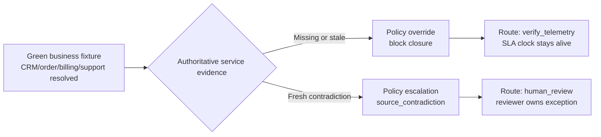
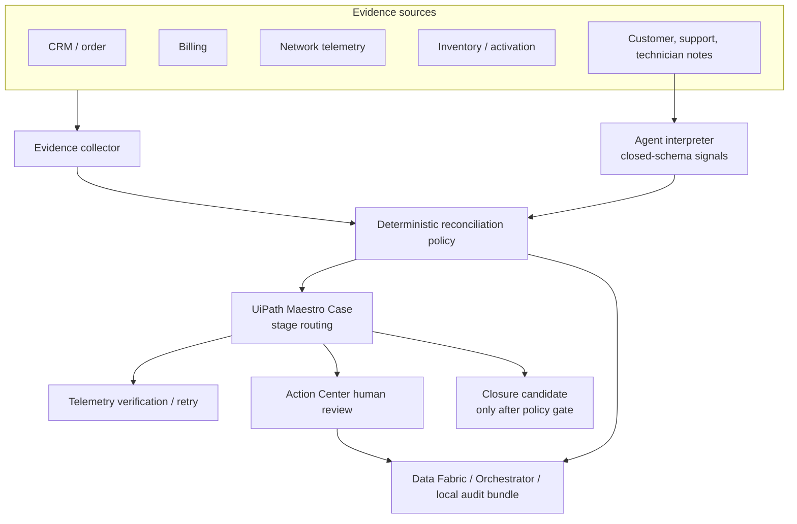

# ClearPath Recovery

Governed telecom service recovery with UiPath Maestro Case.

ClearPath Recovery is a UiPath AgentHack Maestro Case submission for broadband activation and restoration exceptions. It proves a concrete operating pattern for service-recovery teams:

> Agents interpret ambiguous evidence into structured signals. Policy decides allowed actions. Maestro Case enforces routing. Humans own high-impact exceptions. Explanations are generated once and logged.

The project is intentionally narrow. It is not a generic AI governance platform, and it does not claim production telecom OSS/BSS integration. The telecom systems are simulated so the submission can focus on the hard case-management problem: preventing unsafe closure when CRM, order, billing, and support systems look resolved but authoritative service evidence is missing, stale, or contradictory.

## Why It Matters

Telecom recovery workflows often fail at the exact moment they look clean on paper:

- CRM says the customer is active.
- The order system says activation completed.
- Billing says the account is clear.
- A support note suggests closure.
- Fresh network telemetry or inventory may still say the customer has no working service.

A naive agent can amplify that risk by recommending closure from the cleanest text field. ClearPath keeps the agent useful, but bounded: it converts messy notes into structured signals, then deterministic policy checks source authority, freshness, contradiction, confidence, policy version, and human-review requirements before any closure path is allowed.

The result is a judge-visible proof trail from raw recommendation to policy override to routed case action.

## Core Proof

The strongest demo beat uses one canonical green business fixture. Only the authoritative service evidence changes.

In E-002, the business systems look resolved but telemetry is missing or stale. The agent recommends `closure_candidate`; policy preserves that recommendation, blocks closure, and routes to `verify_telemetry`.

In E-004, the same green fixture receives fresh contradictory telemetry or inventory evidence. The agent can still recommend `closure_candidate`, but policy escalates the case to `human_review` because authoritative evidence disagrees with business state.

That distinction is the point: missing evidence is a controlled verification problem; contradiction is an exception that needs human ownership.



The event boundary is explicit in the artifacts: the raw Agent Interpretation Event is stored separately from the final Policy Decision Event. Reviewers can inspect what the agent recommended, why policy overrode it, which evidence source caused the block, and what must be true before closure is safe.

## Architecture

ClearPath has one runtime thesis and three proof surfaces.

Runtime thesis:



Proof surfaces:

- UiPath platform proof: Maestro Case, Action Center lifecycle, Orchestrator package/process/bucket readback, Data Fabric V2 audit record, Test Manager manual execution logs. Start with [PLATFORM_INTEGRATION_PROOF_MAP.md](docs/submission/PLATFORM_INTEGRATION_PROOF_MAP.md).
- Judge-readable proof: evidence-packet HTML, screenshots, proof index, action payloads, and audit bundles in [docs/demo/artifacts/](docs/demo/artifacts/).
- Deterministic local proof: unit tests, eval scenarios E-001 through E-009, submission verifier, and demo scripts in [service_recovery_core/](service_recovery_core/), [fixtures/](fixtures/), [tests/](tests/), and [scripts/](scripts/).

## UiPath Platform Fit

ClearPath is a Maestro Case submission because the workflow is dynamic, long-running, exception-heavy casework. The route emerges from evidence state, not from a single fixed happy path.

- Maestro Case is the orchestration boundary for case lifecycle, stages, routing, and runtime package proof.
- Action Center owns human task lifecycle, assignment, reviewer action/comment, and structured return.
- Data Fabric V2 stores queryable audit records for the full E-004 domain payload.
- Orchestrator provides package/process/version readback and an alternate bucket-backed audit artifact.
- Test Manager represents E-001 through E-009 with 9/9 manual execution evidence.
- UiPath CLI provides repeatable readback instead of screenshot-only claims.

Current validated boundary: native Case and Action Center prove orchestration and reviewer lifecycle, but generated Action Center UI was not reliable enough for proof-critical readability. The final demo uses custom evidence packets as the readable surface while keeping UiPath as the orchestration and audit boundary. See [VALIDATION_GATES.md](docs/validation/VALIDATION_GATES.md) and [VALIDATION_RESULTS.md](docs/validation/VALIDATION_RESULTS.md).

## Key Proof Artifacts

| Artifact | What to inspect |
| --- | --- |
| [Proof index](docs/demo/artifacts/proof_index.html) | Judge-facing entry point for E-002, E-004, E-003 adversarial, and E-008 learning-loop proof. |
| [E-002 evidence packet](docs/demo/artifacts/evidence_packet_E002.html) | Missing/stale authoritative evidence blocks closure and routes to `verify_telemetry`. |
| [E-004 evidence packet](docs/demo/artifacts/evidence_packet_E004.html) | Fresh contradiction escalates to `human_review`. |
| [E-003 adversarial live packet](docs/demo/artifacts/evidence_packet_E003_adversarial_live.html) | Optional Gemini/Vertex advocate/skeptic disagreement, still controlled by deterministic policy. |
| [E-004 audit bundle](docs/demo/artifacts/service_recovery_audit_bundle_E004.json) | One-object audit reconstruction for the contradiction path. |
| [Demo proof manifest](docs/demo/artifacts/demo_proof_manifest.json) | Machine-readable index of generated proof artifacts. |
| [E-008 policy improvement artifact](docs/demo/artifacts/policy_improvement_E008.json) | Governed learning loop where policy improvement remains proposal-only. |
| [Platform integration proof map](docs/submission/PLATFORM_INTEGRATION_PROOF_MAP.md) | End-to-end map from local deterministic proof to UiPath-native proof. |
| [Coding-agent proof log](docs/submission/CODING_AGENT_PROOF_LOG.md) | Auditable Codex build and validation contribution. |
| [Presentation deck PDF](docs/submission/presentation_deck/rendered/governed_service_recovery_uipath_agenthack.pdf) | Submission story in slide form. |

Additional submission docs:

- [SUBMISSION_BRIEF.md](docs/submission/SUBMISSION_BRIEF.md)
- [DEVPOST_PROJECT_STORY.md](docs/submission/DEVPOST_PROJECT_STORY.md)
- [READINESS_CHECKLIST.md](docs/submission/READINESS_CHECKLIST.md)
- [TRACK_SELECTION_DECISION.md](docs/submission/TRACK_SELECTION_DECISION.md)
- [PRODUCT_FEEDBACK_AWARD.md](docs/product/PRODUCT_FEEDBACK_AWARD.md)

## Repository Guide

Use these paths when reviewing the implementation:

- [service_recovery_core/](service_recovery_core/) contains the deterministic recovery core, policy engine, eval runner, LLM adapters, packet rendering, proof-index generation, and audit-bundle generation.
- [fixtures/eval_scenarios.json](fixtures/eval_scenarios.json) defines E-001 through E-009.
- [tests/](tests/) covers policy, schema validation, evidence packets, proof generation, external evidence, UiPath payloads, and submission checks.
- [docs/architecture/](docs/architecture/) documents the data model, agent contract, policy model, integration map, and case workflow.
- [docs/demo/](docs/demo/) contains the storyboard, proof runbook, final video script, and generated proof artifacts.
- [docs/validation/](docs/validation/) records hard-gate validation, eval mapping, Test Manager evidence, and objective completion audit.
- [docs/product/](docs/product/) contains the product-feedback award package.
- [docs/submission/](docs/submission/) contains the Devpost story, proof map, readiness docs, coding-agent proof, decks, thumbnail, and architecture assets.

## Quick Start

Use Python 3.11+ from the repository root.

```sh
python3 -m pip install .
python3 -m unittest discover -s tests
python3 -m service_recovery_core.evals --output eval_results/local_baseline.json
scripts/run_submission_check.sh
```

Expected baseline:

- Unit tests pass.
- Local evals E-001 through E-009 pass 9/9.
- `scripts/run_submission_check.sh` completes without mutating live UiPath state.

## Demo Commands

Regenerate local E-002/E-004 proof artifacts without starting live UiPath work:

```sh
scripts/run_demo.sh --with-local-checks
```

Run the non-mutating final submission proof check:

```sh
scripts/run_submission_check.sh
```

Refresh the optional live Gemini/Vertex interpretation only when ADC/API access is intentionally available:

```sh
scripts/run_llm_demo.sh --evidence-packet-output docs/demo/artifacts/evidence_packet_E003_adversarial_live.html
```

## Validation Status

Current baseline:

- Local unit tests and evals are expected to pass through [scripts/run_submission_check.sh](scripts/run_submission_check.sh).
- UiPath Labs validation ran against org `keepingitlowkey`, tenant `DefaultTenant`.
- Action Center lifecycle and structured reviewer return are validated.
- Data Fabric V2 stores and reads back the E-004 full-payload audit record.
- Orchestrator bucket audit artifact remains the alternate full-payload proof path.
- Test Manager project `SREV`, test set `SREV:9`, and terminal manual execution represent E-001 through E-009 with 9/9 passed logs.

Detailed status lives in [VALIDATION_RESULTS.md](docs/validation/VALIDATION_RESULTS.md), [PLATFORM_INTEGRATION_PROOF_MAP.md](docs/submission/PLATFORM_INTEGRATION_PROOF_MAP.md), and [READINESS_CHECKLIST.md](docs/submission/READINESS_CHECKLIST.md).

## Honest Boundaries

ClearPath is designed to be reviewable without overclaiming:

- Telecom systems are simulated fixtures, not production OSS/BSS integrations.
- The optional external evidence-source path is a systems-of-record simulator, not real carrier integration.
- The LLM can recommend and explain, but it cannot close cases, override policy, or mutate production policy.
- Codex was used for build-time implementation, validation, and documentation support; it is not runtime authority.
- Generated Action Center UI is not presented as the final readable evidence packet.
- Native Maestro Case history alone is not claimed as the complete domain audit.
- Test Manager evidence is manual representation/execution, not automated Test Cloud execution.

## Coding-Agent Disclosure

Codex as the coding agent was used at build time for implementation, validation loops, UiPath CLI investigation, product-feedback evidence gathering, and submission documentation.

The coding-agent proof is intentionally auditable:

- [CODING_AGENT_PROOF_LOG.md](docs/submission/CODING_AGENT_PROOF_LOG.md)
- [coding_agent_evidence_manifest.json](docs/submission/coding_agent_evidence_manifest.json)
- [BUILD_LOG.md](docs/logs/BUILD_LOG.md)
- [run_submission_check.sh](scripts/run_submission_check.sh)

Runtime authority remains unchanged: deterministic policy, UiPath Maestro Case routing, Action Center accountability, and human review own the governed recovery path.

## Product Feedback

The strongest product recommendation from the build is a Maestro Case Human-Review Readiness Check: a preflight and auditability contract for human-review cases that validates tenant services, roles, task schemas, generated page bindings, case/action mappings, package versions, reviewer visibility, and audit coverage before live runtime.

Supporting docs:

- [PRODUCT_FEEDBACK_AWARD.md](docs/product/PRODUCT_FEEDBACK_AWARD.md)
- [FEEDBACK_AWARD_APPENDIX.md](docs/product/FEEDBACK_AWARD_APPENDIX.md)
- [FEEDBACK_SURVEY_FINAL_DRAFT.md](docs/product/FEEDBACK_SURVEY_FINAL_DRAFT.md)

## License

MIT.
