# Product Feedback — Reproduced Evidence Gallery

> This page supports the UiPath AgentHack Best Product Feedback survey submission. Each finding below was reproduced during a live Maestro Case human-review build on org `keepingitlowkey` / tenant `DefaultTenant`. Screenshots and artifacts are committed to this repo, not generated after the fact.

---

## Use Case Summary

Telecom/broadband service activation and restoration exception handling in UiPath Maestro Case. The agent interprets ambiguous evidence into structured signals. Deterministic policy decides the route. Maestro Case enforces routing. Humans own high-impact exceptions. Raw agent recommendation and final policy decision persist as separate linked events.

---

## 1. Is this human-review Case ready to start?

### Actions not enabled for the tenant

Actions was required for human review but was not enabled by default. The disabled-service page did not show the admin path to enable it.

| Before | After |
|---|---|
| 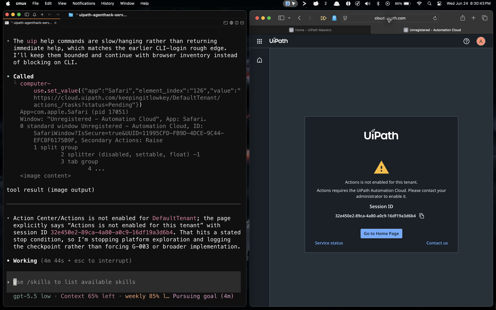 | 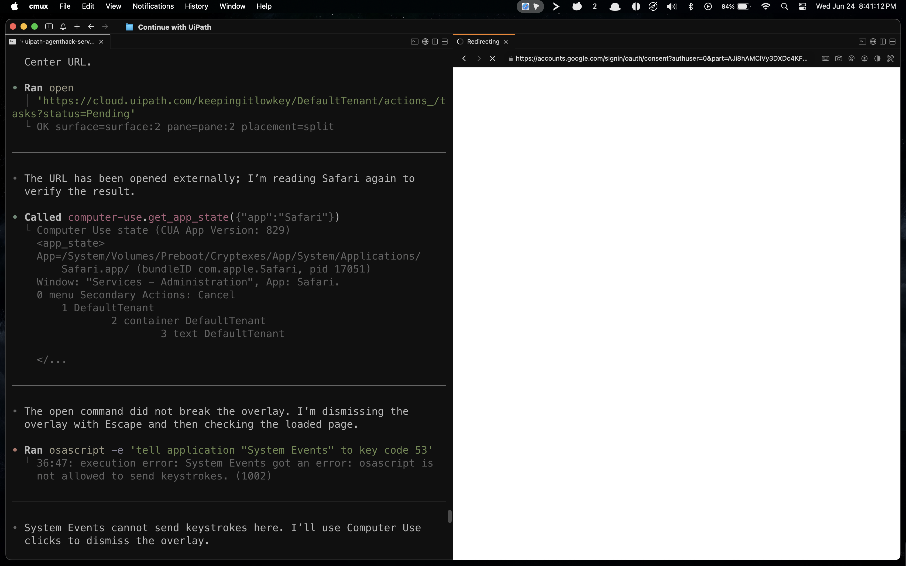 |

### Required Action task `Title` failed only at runtime

Deployment succeeded, but the live Maestro Case faulted with `Failure in the AppTasks request — The Title field is required.` This field was not caught by deployment validation.

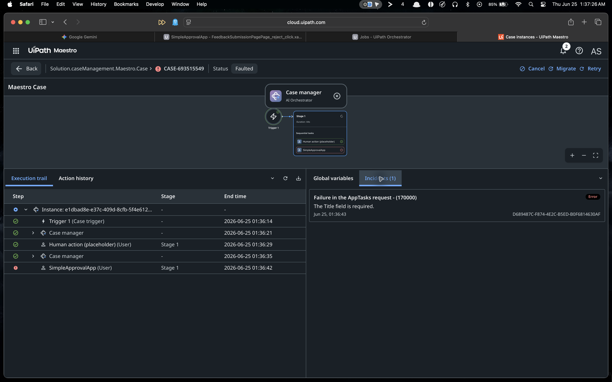

### Inconsistent readiness signals across validation tools

A scratch Case probe showed `uip maestro case validate` catching an invalid Case, while `uip solution pack --dry-run` returned `Status: Valid` and `uip solution upload` accepted the same invalid solution with `ErrorList: []` — three different readiness answers for the same invalid definition.

---

## 2. Will the reviewer see the governing decision clearly?

### `PolicyDecisionJson` rendered as `Unnamed String 1`

The field existed in the Action schema and task metadata, but the generated Action Center reviewer page rendered the proof-critical field as `Unnamed String 1`. The task API (`uip tasks get`) showed the correct persisted value.

| Generated reviewer page (mislabeled) | Task API readback (correct) |
|---|---|
| 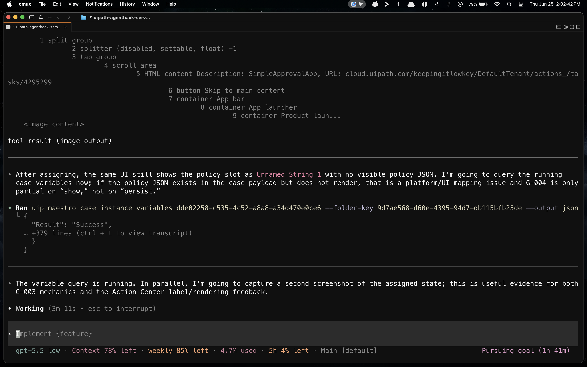 | Field `PolicyDecisionJson` correctly persisted in task metadata via CLI readback |

### Raw agent recommendation visible, but policy decision hidden

The generated page showed `RawAgentRecommendation` and `EvidencePacketJson` controls, but `PolicyDecisionJson` got the broken `Unnamed String 1` label. The platform preserved the right structure — the generated UI did not show it.

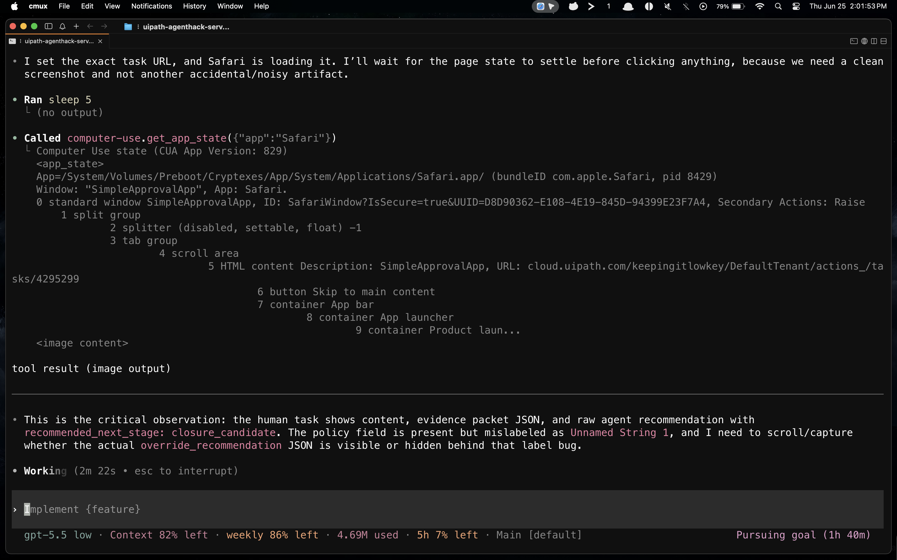

### Generated Action app schema and page binding

The Action app schema exposed typed input/output properties. The generated page partially rendered them — some fields got controls, one got `Unnamed String 1`.

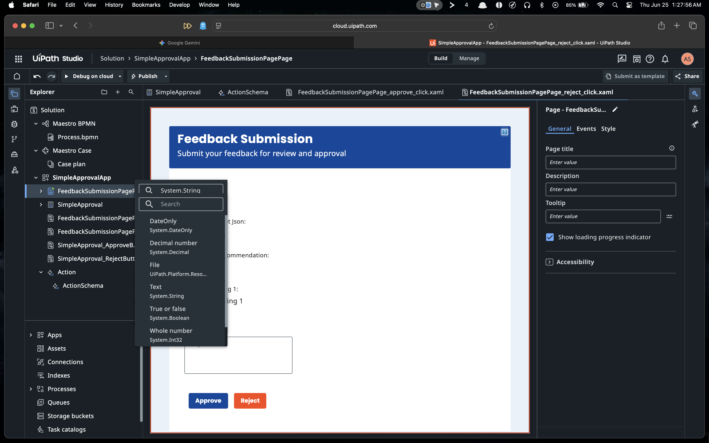

### Deployment succeeded, diagnostics failed

`uip maestro case processes diagnose` returned `summaries.find is not a function` instead of actionable repair guidance for the AppTasks failure.

---

## 3. Can we prove what happened after runtime?

### Action Center lifecycle worked

Despite the generated UI labeling issue, Action Center handled the full task lifecycle: assignment, claim, approve/reject, reviewer comments, and structured return.

| Task completed (reject action) | Completed task readback |
|---|---|
| 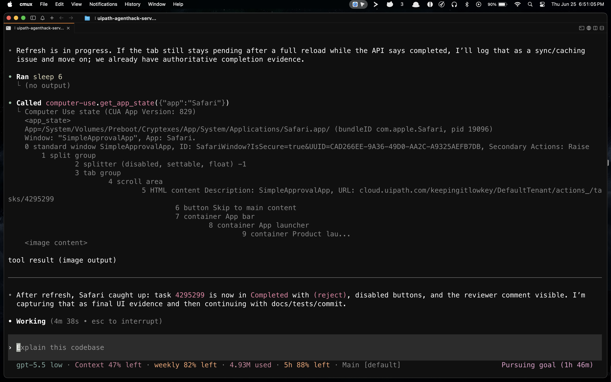 | Reviewer action and comment persisted in task metadata |

### Custom evidence packets — the readable proof surface

Because the generated Action Center page was not reliable for judge-facing proof, we built custom evidence packets as the readable audit surface.

| E-002 Missing Telemetry | E-004 Contradiction / Human Review | E-003 Adversarial LLM |
|---|---|---|
| 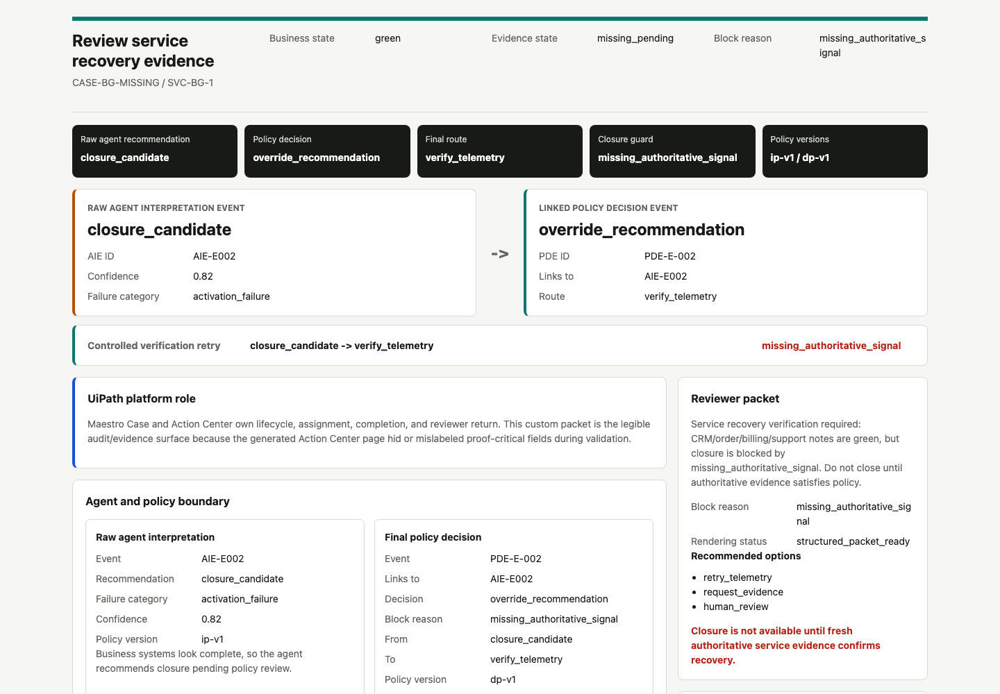 | 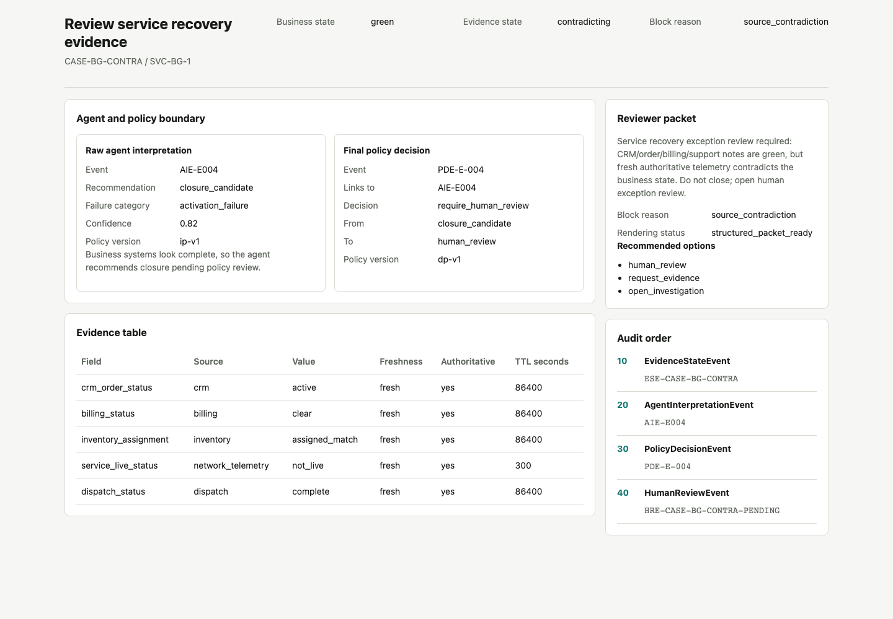 | 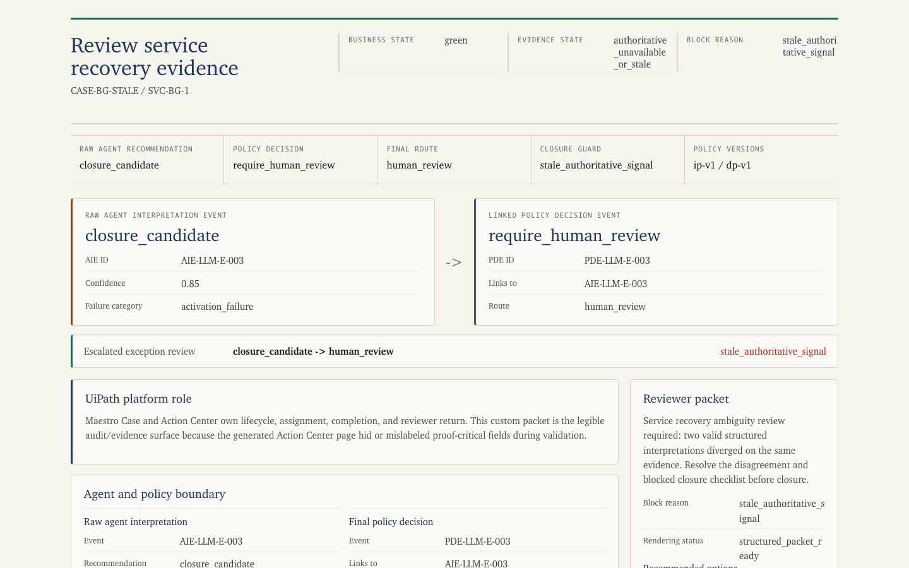 |

### Data Fabric V2 audit readback

After the legacy snake_case entity could not persist custom fields, a PascalCase V2 schema (`ServiceRecoveryAuditBundleV2`) solved full-payload storage and readback. Record `F9D838CE-4671-F111-AC9A-0022489A9A06` read back all custom fields including `CaseId`, raw agent recommendation, policy decision, reviewer packet, and audit bundle JSON.

### Orchestrator bucket audit artifact

The E-004 audit bundle was stored as an Orchestrator bucket artifact and verified through CLI create/upload/list/download/readback.

### Maestro Case project and design surface

| Case project created | Case JSON/code view |
|---|---|
| 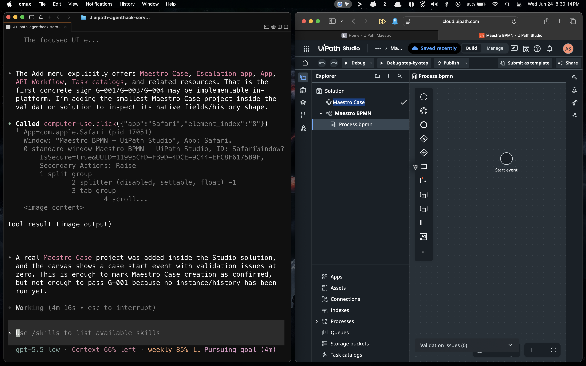 | 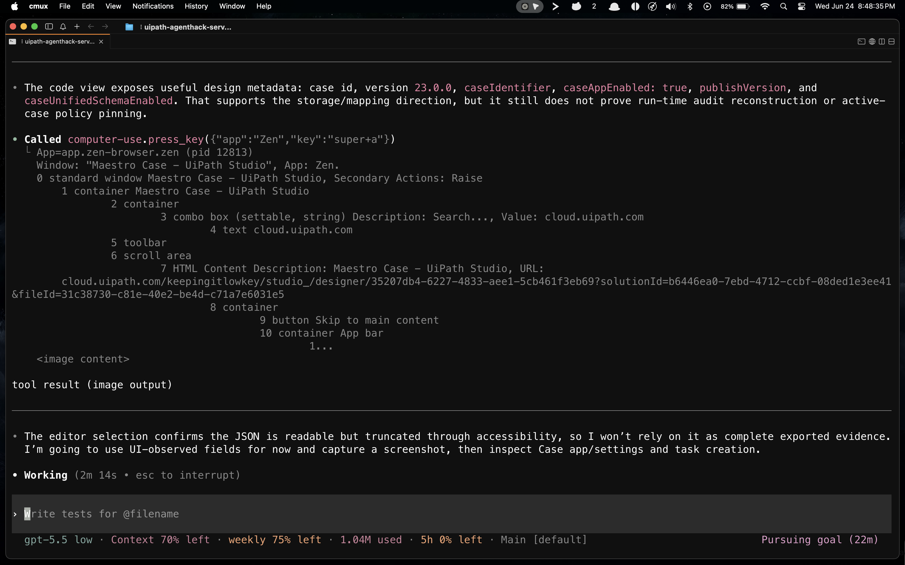 |

### Action app schema — input/output properties

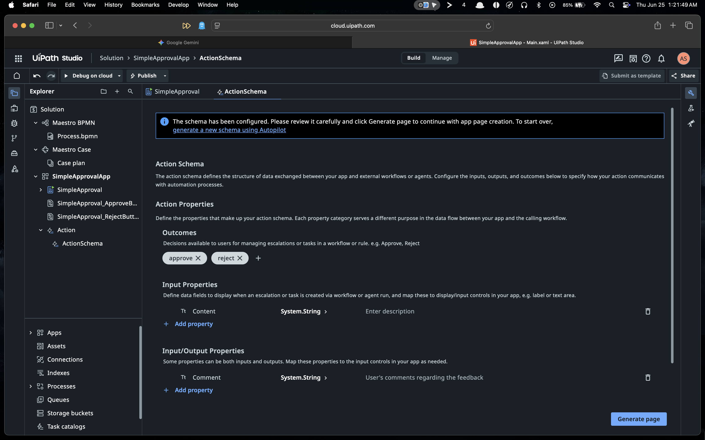

### Human action placeholder on canvas

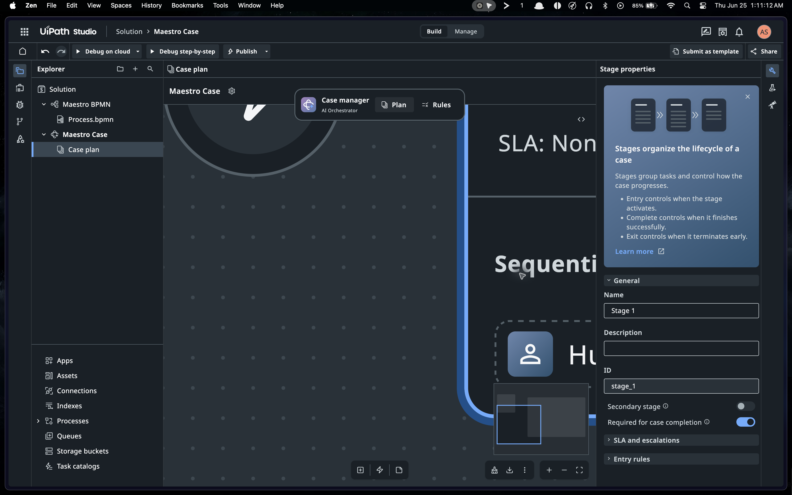

---

## Key Artifacts

| Artifact | Path | What it proves |
|---|---|---|
| E-002 evidence packet (HTML) | [`evidence_packet_E002.html`](../demo/artifacts/evidence_packet_E002.html) | Missing-telemetry path with policy override |
| E-004 evidence packet (HTML) | [`evidence_packet_E004.html`](../demo/artifacts/evidence_packet_E004.html) | Contradiction path with human-review escalation |
| E-003 adversarial packet (HTML) | [`evidence_packet_E003_adversarial_live.html`](../demo/artifacts/evidence_packet_E003_adversarial_live.html) | Adversarial Gemini/Vertex interpretation with policy escalation |
| E-004 audit bundle (JSON) | [`service_recovery_audit_bundle_E004.json`](../demo/artifacts/service_recovery_audit_bundle_E004.json) | Full domain audit: agent event, policy decision, evidence state, timestamps, versions |
| E-002 audit bundle (JSON) | [`service_recovery_audit_bundle_E002.json`](../demo/artifacts/service_recovery_audit_bundle_E002.json) | Missing-telemetry audit: policy override from closure_candidate to verify_telemetry |
| Proof index (HTML) | [`proof_index.html`](../demo/artifacts/proof_index.html) | Judge-facing proof index linking all demo artifacts |
| Demo proof manifest | [`demo_proof_manifest.json`](../demo/artifacts/demo_proof_manifest.json) | Machine-readable artifact manifest |

---

## Top Product Feedback Recommendation

**Add a Maestro Case Human-Review Readiness Check** — one preflight and auditability contract that answers:

1. Before runtime: will this human-review Case actually work? (tenant services, required fields, schema binding, package version, connector readiness)
2. After runtime: can we prove what happened? (linked agent/policy/human events, versions, timestamps in one timeline)

Every screenshot above represents a gap that one readiness report would have caught before runtime.

---

*Full evidence log: [`PRODUCT_FEEDBACK_AWARD.md`](PRODUCT_FEEDBACK_AWARD.md) (29 entries, PF-001 → PF-029)*
*Curated appendix: [`FEEDBACK_AWARD_APPENDIX.md`](FEEDBACK_AWARD_APPENDIX.md)*
